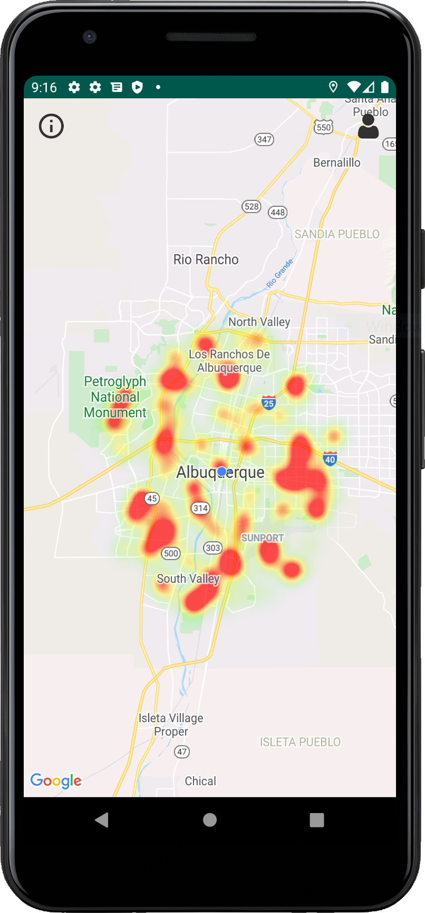
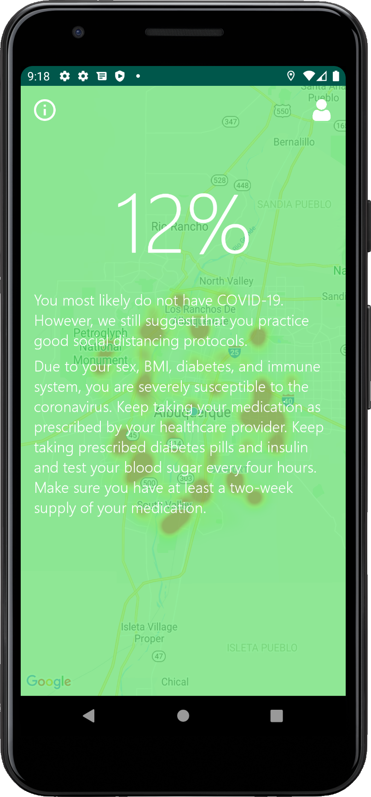
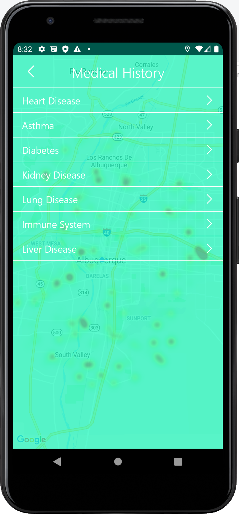

   
     
  
  
  

# COVIDTracker
#### Developed by Andrew Spears, Melinda Modisette, and Jacob Roberts-Baca

Using the built-in Bluetooth technology of users’ smartphones, COVIDTracker generates a probabilistic model to describe the spread of COVID-19, and for each user, generates an estimate of how likely it is that the user is infected. Combining a hassle-free user interface with a reliable mathematical model, COVIDTracker presents users with a free, non-invasive, and educational technology that can be installed and used in the background immediately. In addition to providing users with the estimated probability that they are infected, the app provides a heatmap of infections in the user’s vicinity to give them a bird’s eye view of available infection data. COVIDTracker also allows users to enter information about themselves, such as their age and history of diseases. The app will then remind them of their personal risk and how to behave in the safest manner possible. If a user tests positive for the virus, they can enter their test result into the app and improve the accuracy of the probabilistic model for other users. As concerns due to COVID-19 intensify, COVIDTracker will provide users some degree of certainty amidst a time of seeming unpredictability.

#### How to run the app

The easiest way to run the app is to download and install Bluestacks. Bluestacks is an Android emulator that allows you to download and run Android apps from your computer. You can [find Bluestacks here](https://www.bluestacks.com/). Once Bluestacks has been downloaded and installed, you can download the APK file below, and double click on it to open the file in Bluestacks. Alternatively, if you have an Android device and a way of transfering and installing the downloaded APK file to that device, you can run the app physically as well. 

##### [Download the app here](https://github.com/rbjacob101/corona/releases/tag/v1.0.0)
